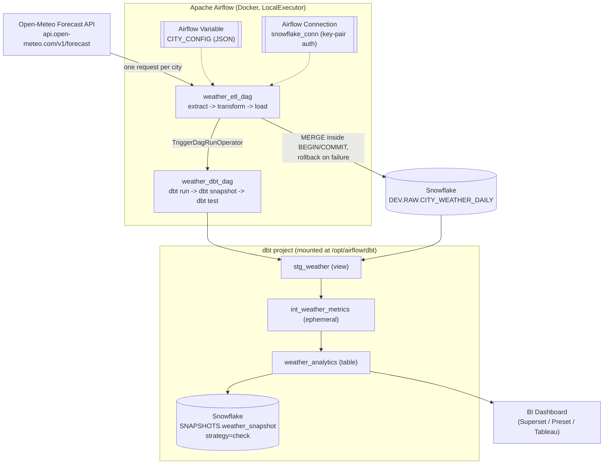

# System Architecture



## Notes

- **Airflow Variable `CITY_CONFIG`** is the single source of truth for which
  cities the pipeline processes. Adding a third city means adding one JSON
  entry -- no DAG or dbt code changes.
- **Airflow Connection `snowflake_conn`** carries all Snowflake auth (account,
  user, role, warehouse, key-pair credentials). No secret is hardcoded in the
  DAGs or committed to the repo.
- **Idempotency** is enforced in `load()` via a `MERGE` keyed on
  `(city, date)` inside an explicit `BEGIN`/`COMMIT` transaction, with a
  duplicate-key check before `COMMIT` and a `ROLLBACK` + re-raise on any
  failure. See `dags/weather_etl_dag.py`.
- **Orchestration dependency**: `weather_dbt_dag` has `schedule=None` and is
  only ever started by `weather_etl_dag`'s final `trigger_dbt_dag` task, so
  dbt never runs on stale or partially-loaded data.
- **dbt snapshot** captures `weather_analytics` with the `check` strategy,
  since Open-Meteo revises very recent days as more observations arrive and
  there is no natural `updated_at` column.

To export a PNG/SVG of the diagram above: paste the ```mermaid``` block into
the [Mermaid Live Editor](https://mermaid.live) and download the image, or
render it locally with `mmdc` (`@mermaid-js/mermaid-cli`) if installed.
