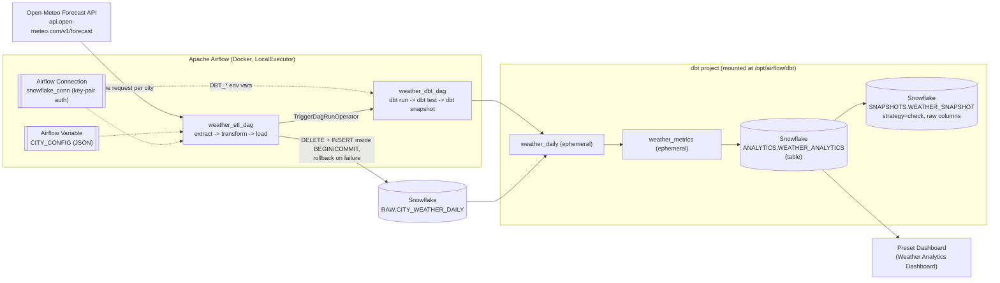

# System Architecture


```mermaid
flowchart LR
    A["Open-Meteo Forecast API\napi.open-meteo.com/v1/forecast"] -->|"one request per city"| B

    subgraph AF["Apache Airflow (Docker, LocalExecutor)"]
        B["weather_etl_dag\nextract -> transform -> load"]
        V[["Airflow Variable\nCITY_CONFIG (JSON)"]] -.-> B
        C[["Airflow Connection\nsnowflake_conn (key-pair auth)"]] -.-> B
        C -.->|"DBT_* env vars"| D
        B -->|"TriggerDagRunOperator"| D["weather_dbt_dag\ndbt run -> dbt test -> dbt snapshot"]
    end

    B -->|"DELETE + INSERT inside BEGIN/COMMIT,\nrollback on failure"| E[("Snowflake\nRAW.CITY_WEATHER_DAILY")]

    subgraph DBT["dbt project (mounted at /opt/airflow/dbt)"]
        D --> F["weather_daily (ephemeral)"]
        F --> G["weather_metrics (ephemeral)"]
        G --> H[("Snowflake\nANALYTICS.WEATHER_ANALYTICS\n(table)")]
        H --> I[("Snowflake\nSNAPSHOTS.WEATHER_SNAPSHOT\nstrategy=check, raw columns")]
    end

    E --> F
    H --> J["Preset Dashboard\n(Weather Analytics Dashboard)"]
```

## Notes

- **Airflow Variable `CITY_CONFIG`** is the single source of truth for which
  cities the pipeline processes. Adding a third city means adding one JSON
  entry, plus the city name in the `accepted_values` test in
  `dbt/models/schema.yml`. No DAG or model code changes are needed.
- **Airflow Connection `snowflake_conn`** carries all Snowflake auth
  (account, user, role, warehouse, database, key-pair credentials) for both
  DAGs. `weather_etl_dag` uses it through `SnowflakeHook`, and
  `weather_dbt_dag` reads it with `BaseHook` and passes the values to dbt as
  `DBT_*` environment variables, which `dbt/profiles.yml` reads with
  `env_var()`. No secret or database name is hardcoded in the DAGs or
  committed to the repo; every table is created in the database set on the
  Connection.
- **Idempotency** is enforced in `load()` with a full refresh: `DELETE` +
  `INSERT` inside an explicit `BEGIN`/`COMMIT` transaction, with `ROLLBACK`
  + re-raise on any failure. Each run leaves the raw table holding exactly
  the past 60 days plus today for each city (2 cities x 61 days = 122 rows),
  no matter how many times it runs. The `RAW` schema and table are created
  before `BEGIN`, since Snowflake DDL auto-commits. See
  `dags/weather_etl_dag.py`.
- **Orchestration dependency**: `weather_dbt_dag` has `schedule=None` and is
  only ever started by `weather_etl_dag`'s final `trigger_dbt_dag` task, so
  dbt never runs on stale or partially-loaded data. Both DAGs use
  `max_active_runs=1`, so two loads can't write to the raw table at the same
  time. `dbt test` runs before `dbt snapshot`, so only data that passed its
  tests is snapshotted.
- **dbt models**: `weather_daily` and `weather_metrics` are ephemeral, so
  they are inlined as CTEs and `WEATHER_ANALYTICS` is the only table dbt
  builds in the `ANALYTICS` schema.
- **dbt snapshot** captures `WEATHER_ANALYTICS` with the `check` strategy,
  since Open-Meteo revises very recent days as more observations arrive and
  there is no natural `updated_at` column. `check_cols` only includes the raw
  weather columns (`temp_max`, `temp_min`, `precipitation`, `weather_code`),
  because the computed metrics shift every time the 61-day window moves.
  A new version is recorded only when a day's values are revised or a day
  ages out of the window.

A pre-rendered `architecture_diagram.png` (generated from this file's
Mermaid source via `mmdc`) lives alongside this file and is embedded
directly in `docs/report.md` Section 4. To regenerate it after editing the
diagram above, extract the ```mermaid``` block to `architecture.mmd` and run
`mmdc -i architecture.mmd -o architecture_diagram.png -b white -s 3`, or
paste the block into the [Mermaid Live Editor](https://mermaid.live).
