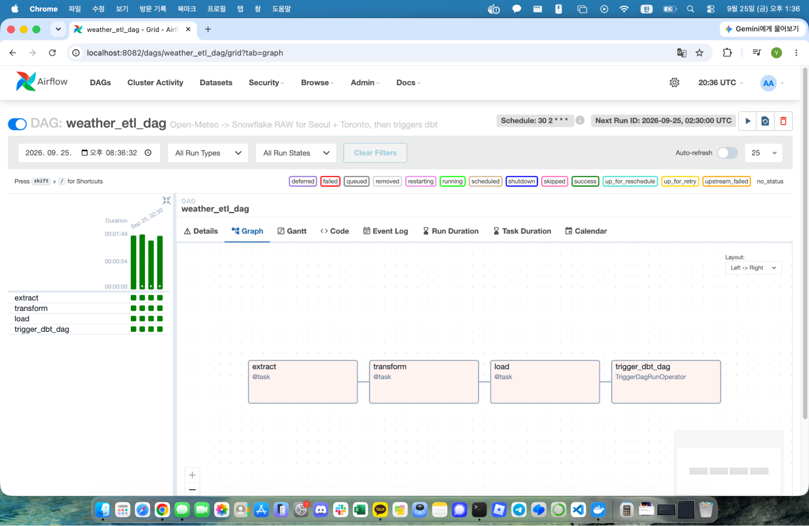
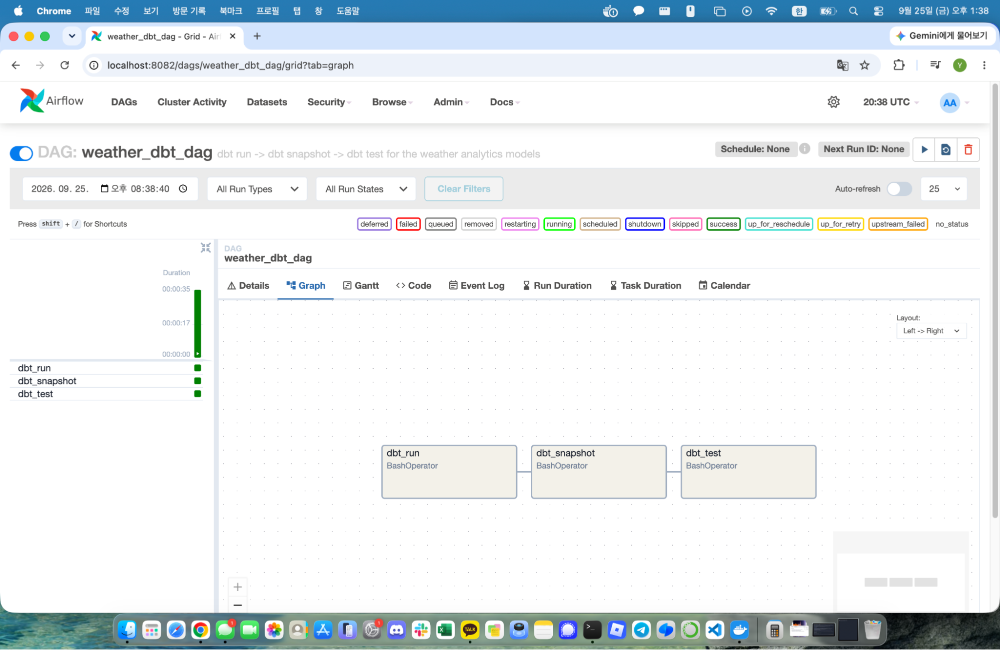
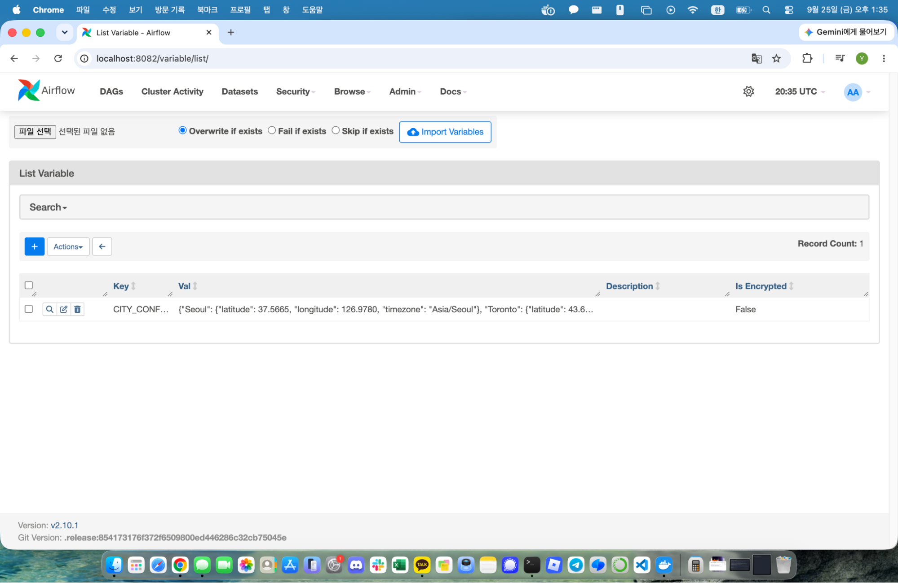
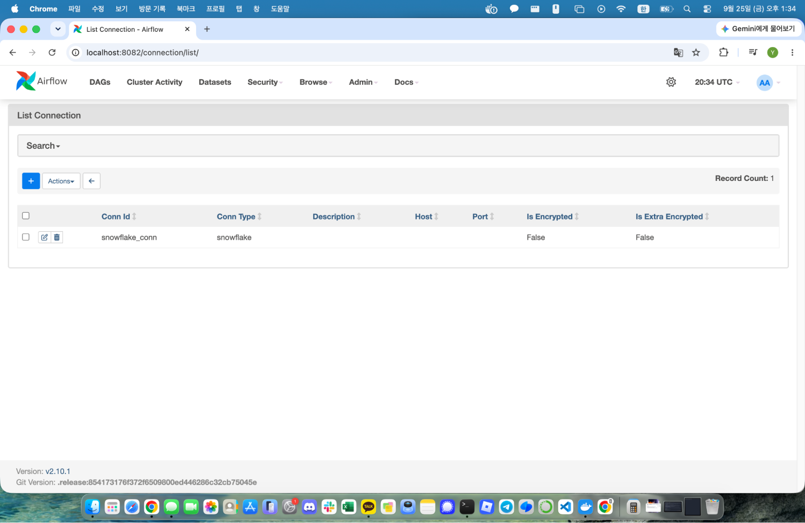
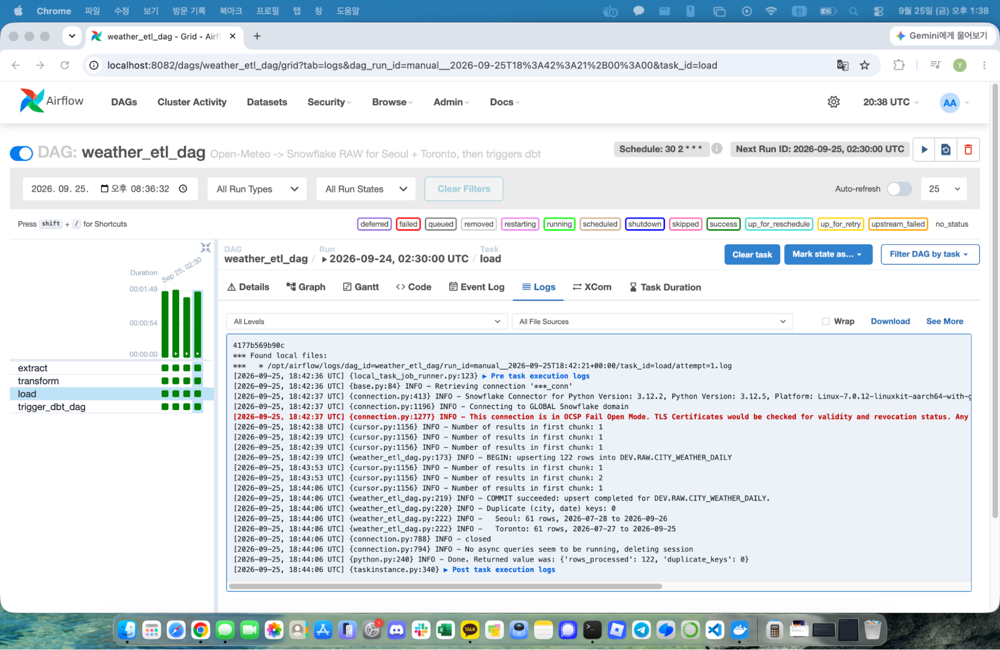
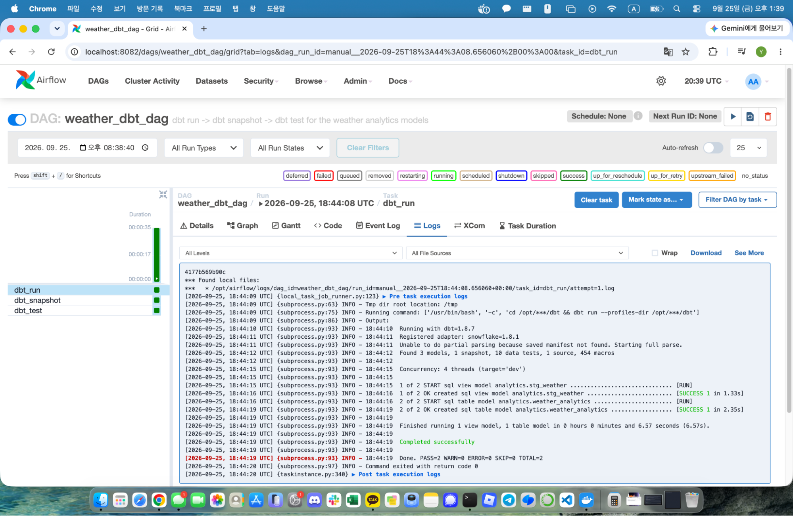
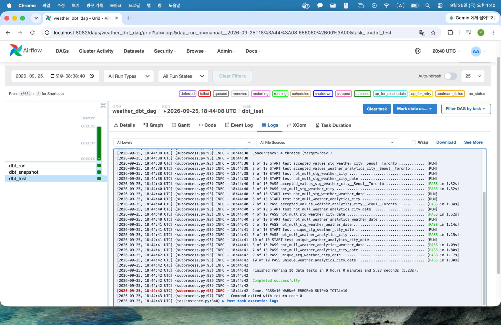
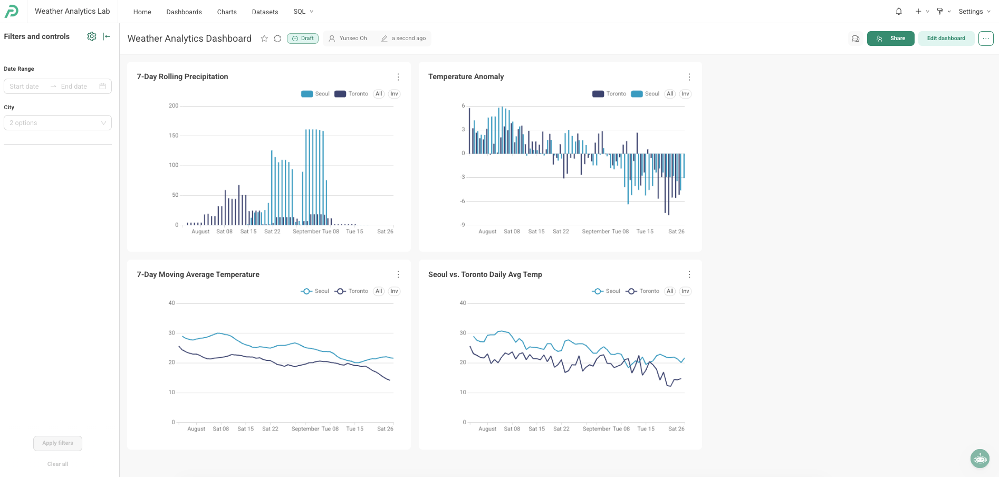
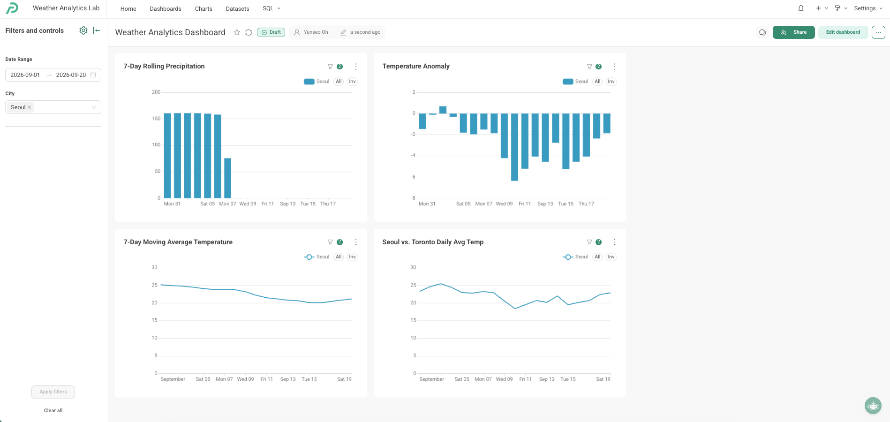

# Weather Prediction Analytics using Snowflake, Airflow, and dbt

**Course:** SJSU DATA 226
**Team members:** Yunseo Oh (020746206), Isabella Shi (019256965)
**Repository:** https://github.com/yunseoyunnieoh/data226-weather-analytics
**Date:** [INSERT SUBMISSION DATE]

---

## 1. Problem Statement

Weather affects planning decisions -- commuting, travel, agriculture, retail
demand -- but raw daily weather readings (a max/min temperature and a
precipitation total) don't answer questions like "is this warmer than usual"
or "how long has it been dry." This project builds a pipeline that pulls
daily weather for two cities, Seoul and Toronto, ingests it into a cloud
data warehouse, derives multi-day analytics from it (moving averages,
anomalies, rolling precipitation, dry spell length), and exposes those
analytics through a BI dashboard -- so a viewer can compare the two cities'
current weather trend at a glance instead of reading raw numbers.

A secondary goal, driven by the assignment itself, was architectural: build
**one** pipeline that treats "which city" as configuration/data rather than
duplicating the ETL and transformation logic per city.

## 2. Requirements

1. Ingest daily weather for two cities (Seoul, Toronto) from the Open-Meteo
   API (`https://api.open-meteo.com/v1/forecast`).
2. Load it into Snowflake with a transaction-safe, idempotent write path
   (safe to rerun without creating duplicate rows).
3. Orchestrate the ingestion with Apache Airflow, using Airflow Variables
   for city configuration and an Airflow Connection for Snowflake
   credentials -- no hardcoded secrets.
4. Transform the raw data with dbt into meaningful, per-city analytics
   (moving averages, anomaly, rolling precipitation, dry spell length),
   with schema tests and a snapshot.
5. Trigger the dbt run from Airflow, strictly after the ETL succeeds.
6. Visualize the resulting analytics in a BI tool (Superset, Preset, or
   Tableau) with at least two screenshots showing the dashboard responding
   to a filter change.
7. Ship one GitHub repository containing all code, with DAGs under `dags/`
   and the dbt project under `dbt/`, plus a README and this report.

## 3. Specifications

| Component | Choice | Why |
| --- | --- | --- |
| Source API | Open-Meteo `/v1/forecast`, `past_days=60`, `forecast_days=1` | Required endpoint; `past_days` gives enough trailing history in one request per city for 7-day windows and an anomaly baseline |
| City config | Airflow Variable `CITY_CONFIG` (JSON: name -> lat/lon/timezone) | Adding a city means adding one JSON entry, no code change |
| Orchestration | Two DAGs: `weather_etl_dag` (schedule) -> `weather_dbt_dag` (triggered, `schedule=None`) | Makes the ETL-before-dbt dependency explicit and inspectable in the Airflow UI, not just implied by cron timing |
| Raw table | `DEV.RAW.CITY_WEATHER_DAILY`, PK `(city, date)` | New table name, distinct from the single-city HW2/HW3 `WEATHER_DAILY` table, to avoid touching already-graded data with an incompatible schema |
| Idempotency | `MERGE` keyed on `(city, date)` inside `BEGIN`/`COMMIT`, with a duplicate-key check before `COMMIT` | Snowflake does not enforce declared primary keys on standard tables, so uniqueness is enforced by the merge logic and verified explicitly, not assumed from the DDL |
| dbt layers | `stg_weather` (view) -> `int_weather_metrics` (ephemeral) -> `weather_analytics` (table) | Mirrors the layering used in the team's HW4 dbt project |
| Snapshot | `weather_snapshot`, `strategy='check'` on `weather_analytics` | No natural `updated_at` column exists, and Open-Meteo revises very recent days as more observations arrive, so `check` is more appropriate than `timestamp` |
| BI tool | [Preset](https://preset.io) (cloud-hosted Apache Superset) | Free tier, no local install/Docker needed, connects directly to Snowflake |

## 4. Architecture

See `docs/architecture.md` for the full Mermaid diagram and narrative. In
short:

```
Open-Meteo API --> Airflow (weather_etl_dag: extract/transform/load) --> Snowflake RAW
    --> [TriggerDagRunOperator] --> Airflow (weather_dbt_dag: dbt run/snapshot/test)
    --> dbt staging -> intermediate -> analytics --> Snowflake analytics layer
    --> BI dashboard
```





## 5. Data Flow

1. `weather_etl_dag.extract()` reads `CITY_CONFIG`, calls Open-Meteo once
   per city, returns raw JSON payloads.
2. `weather_etl_dag.transform()` flattens each city's daily arrays into
   `(city, latitude, longitude, date, temp_max, temp_min, precipitation,
   weather_code)` rows, validating array lengths and rejecting an empty
   batch.
3. `weather_etl_dag.load()` upserts those rows into
   `DEV.RAW.CITY_WEATHER_DAILY` via a staged `MERGE` inside one transaction,
   then triggers `weather_dbt_dag`.
4. `weather_dbt_dag` runs `dbt run` (builds `stg_weather`,
   `int_weather_metrics`, `weather_analytics`), then `dbt snapshot`
   (`weather_snapshot`), then `dbt test`.
5. The BI tool queries `DEV.ANALYTICS.WEATHER_ANALYTICS` directly.

## 6. Airflow Implementation

- **DAG 1 -- `weather_etl_dag`** (`dags/weather_etl_dag.py`): TaskFlow API
  (`@task`), tasks `extract -> transform -> load`, scheduled daily
  (`30 2 * * *`), `catchup=False`, `max_active_runs=1`. Final task
  `trigger_dbt_dag` (`TriggerDagRunOperator`) starts `weather_dbt_dag` after
  `load` succeeds.
- **DAG 2 -- `weather_dbt_dag`** (`dags/weather_dbt_dag.py`): three
  `BashOperator` tasks, `dbt_run -> dbt_snapshot -> dbt_test`, each invoking
  `dbt <command> --profiles-dir /opt/airflow/dbt` against the dbt project
  mounted into the container. `schedule=None`: this DAG never runs on its
  own timer, only via the trigger from DAG 1.
- **Airflow Variable**: `CITY_CONFIG`, a JSON object mapping city name to
  `{latitude, longitude, timezone}`.
- **Airflow Connection**: `snowflake_conn`, type Snowflake, key-pair
  authentication (private key file mounted read-only into the container;
  passphrase stored only in the Connection's Password field / a local
  `.env`, never in code).
- **Exception handling**: `load()` wraps the transaction in
  `try/except/finally`; on any exception it issues `ROLLBACK`, logs the
  outcome, and **re-raises** so the Airflow task is correctly marked failed
  (no silent swallowing). `extract()`/`transform()` raise `ValueError` on
  malformed API responses or empty batches rather than loading partial data.







## 7. Snowflake Design

Database `DEV`, schema `RAW` for the landing table, schema `ANALYTICS` for
dbt's output, schema `SNAPSHOTS` for the dbt snapshot. See `sql/create_tables.sql`
for the raw table DDL (also embedded in `weather_etl_dag.py`'s `load()` so
the pipeline is self-provisioning).

## 8. Table Structures

### `DEV.RAW.CITY_WEATHER_DAILY` (raw, loaded by Airflow)

| Column | Type | Constraint | Description |
| --- | --- | --- | --- |
| CITY | VARCHAR(64) | NOT NULL, part of PK | City name (`Seoul`, `Toronto`) |
| LATITUDE | FLOAT | NOT NULL | Requested latitude |
| LONGITUDE | FLOAT | NOT NULL | Requested longitude |
| DATE | DATE | NOT NULL, part of PK | Local calendar date of the reading |
| TEMP_MAX | FLOAT | nullable | Daily max temperature, Celsius |
| TEMP_MIN | FLOAT | nullable | Daily min temperature, Celsius |
| PRECIPITATION | FLOAT | nullable | Daily precipitation total, mm |
| WEATHER_CODE | INTEGER | nullable | WMO weather interpretation code |
| LOADED_AT | TIMESTAMP_NTZ | default `CURRENT_TIMESTAMP()` | Last upsert time for this row |

Declared key: `PRIMARY KEY (CITY, DATE)` (declarative only in Snowflake;
enforced by the `MERGE` + duplicate-check in `load()`, not by the database).

### `DEV.ANALYTICS.stg_weather` (dbt view)

Same columns as the raw table (renamed `DATE` -> `WEATHER_DATE`) plus
`CITY_DATE` (surrogate key: `CITY || '_' || DATE`).

### `DEV.ANALYTICS.weather_analytics` (dbt table -- BI source)

| Column | Type | Description |
| --- | --- | --- |
| CITY | VARCHAR | Partition key for every window function |
| LATITUDE, LONGITUDE | FLOAT | Carried through from raw |
| WEATHER_DATE | DATE | Calendar date |
| CITY_DATE | VARCHAR | Surrogate key, tested `unique` + `not_null` |
| TEMP_MAX, TEMP_MIN, PRECIPITATION, WEATHER_CODE | FLOAT/INTEGER | Carried through from raw |
| DAILY_AVG_TEMP | FLOAT | `(TEMP_MAX + TEMP_MIN) / 2` |
| DRY_SPELL_LENGTH | INTEGER | Consecutive dry days (< 0.1mm precip) ending on this date |
| MOVING_AVG_TEMP_7D | FLOAT | 7-day trailing average of `DAILY_AVG_TEMP`, partitioned by city |
| TEMP_ANOMALY | FLOAT | `DAILY_AVG_TEMP` minus that city's average over the loaded window |
| ROLLING_PRECIP_7D | FLOAT | 7-day trailing sum of `PRECIPITATION`, partitioned by city |

### `DEV.SNAPSHOTS.weather_snapshot` (dbt snapshot)

`weather_analytics` columns plus dbt's snapshot metadata
(`dbt_scd_id`, `dbt_updated_at`, `dbt_valid_from`, `dbt_valid_to`).
Strategy: `check` on the metric columns, keyed on `CITY_DATE`.

## 9. Idempotency Design

Rerunning `weather_etl_dag` for the same day must not create duplicate rows.
This is enforced in `load()` (`dags/weather_etl_dag.py`) as follows:

1. `CREATE TABLE IF NOT EXISTS` runs **before** `BEGIN`, since Snowflake DDL
   auto-commits and would otherwise break an open transaction.
2. New rows are inserted into a temporary staging table, then merged into
   `CITY_WEATHER_DAILY` with `MERGE ... ON (city, date) WHEN MATCHED THEN
   UPDATE ... WHEN NOT MATCHED THEN INSERT` -- all inside one `BEGIN`.
3. Before `COMMIT`, a `GROUP BY (city, date) HAVING COUNT(*) > 1` query
   verifies no duplicate keys exist, because Snowflake's declared
   `PRIMARY KEY` is not enforced.
4. Any exception anywhere in the block triggers `ROLLBACK` and re-raises,
   so Airflow marks the task failed and no partial write is left committed.

Net effect: running the DAG twice for the same date updates that date's row
in place rather than appending a second copy.

## 10. dbt Implementation

See `dbt/README.md` for the full layer-by-layer breakdown. Summary:
`stg_weather` (view) -> `int_weather_metrics` (ephemeral) ->
`weather_analytics` (table), all analytics window functions
`PARTITION BY city`.

## 11. dbt Models

- `models/staging/stg_weather.sql`
- `models/intermediate/int_weather_metrics.sql`
- `models/analytics/weather_analytics.sql`

## 12. dbt Tests

Defined in `models/schema.yml`: `unique` + `not_null` on `city_date` for
both `stg_weather` and `weather_analytics`; `not_null` on `city` and
`weather_date`; `accepted_values` on `city` (`Seoul`, `Toronto`).





## 13. dbt Snapshot

`snapshots/weather_snapshot.sql`, `strategy='check'`, keyed on `city_date`.
See Section 8 for its resulting columns and Section 3 for why `check` was
chosen over `timestamp`.

![Figure 8. weather_dbt_dag "dbt_snapshot" task log: 1 of 1 OK snapshotted snapshots.weather_snapshot [SUCCESS 244 in 6.47s]](../screenshots/08_dbt_snapshot_log.png)

## 14. Airflow/dbt Scheduling

`weather_etl_dag` is the only DAG on a cron schedule (`30 2 * * *`).
`weather_dbt_dag` has `schedule=None` and is started exclusively by
`weather_etl_dag`'s last task, `trigger_dbt_dag`
(`TriggerDagRunOperator(trigger_dag_id="weather_dbt_dag")`). This makes the
"ETL succeeds, then dbt runs" dependency visible directly in the DAG code
and in the Airflow UI (two separate DAGs, one triggering the other), rather
than relying on scheduling two DAGs far enough apart in time.

## 15. BI Dashboard

**Status: complete.** **Tool:** [Preset](https://preset.io) (cloud-hosted
Apache Superset). **Team/Workspace:** "DATA 226 Weather Analytics" /
"Weather Analytics Lab". **Dashboard name:** "Weather Analytics Dashboard".
**Dataset:** `DEV.ANALYTICS.WEATHER_ANALYTICS`.

**Purpose:** let a viewer compare Seoul vs. Toronto's current weather trend
-- temperature level and trajectory, anomaly, and precipitation -- without
reading raw numbers. **Usage:** select a city (or leave both selected) via
the dashboard's `CITY` filter, narrow the `WEATHER_DATE` time range, and all
four charts update together.

**Authentication:** Preset could not use a plain Snowflake username/password
connection because this account requires MFA/TOTP. The dashboard instead
connects using the same Snowflake **key-pair authentication** already used
by Airflow and dbt, configured through Preset's **Advanced -> Security ->
Secure Extra** field rather than the basic login form. That field lives only
in Preset's hosted connection config -- the key and passphrase were never
written to this repository. See the root `README.md` -> "Security /
secrets".

**The four charts, all grouped by `CITY`:**

1. **Seoul vs. Toronto Daily Avg Temp** -- line chart, X = `WEATHER_DATE`,
   metric `AVG(DAILY_AVG_TEMP)`, dimension `CITY`.
2. **7-Day Moving Average Temperature** -- line chart, X = `WEATHER_DATE`,
   metric `AVG(MOVING_AVG_TEMP_7D)`, dimension `CITY`.
3. **Temperature Anomaly** -- bar chart, X = `WEATHER_DATE`, metric
   `AVG(TEMP_ANOMALY)`, dimension `CITY`.
4. **7-Day Rolling Precipitation** -- bar chart, X = `WEATHER_DATE`, metric
   `AVG(ROLLING_PRECIP_7D)`, dimension `CITY`.

**Filters:** native dashboard filters on `CITY` and on `WEATHER_DATE` (time
range), applied across all four charts at once.





## 16. Results / Observations

The pipeline was run end-to-end against live data (see Section 20 note on
verification). As of the run on 2026-09-25/26, over the ~61-day loaded
window:

- Both cities were in the middle of an extended dry spell at the same time:
  Seoul had gone 14 consecutive days with under 0.1mm of precipitation,
  Toronto 17 days -- both `rolling_precip_7d` values were at or effectively
  at 0.
- Both cities' most recent days ran cooler than their loaded-window average:
  Seoul's temperature anomaly was around -3 to -5 degrees C over its last
  several days; Toronto's was around -5 to -8 degrees C, reaching -7.76 on
  2026-09-22 (its `daily_avg_temp` that day, 12.15 degrees C, was well under
  its ~19.9 degrees C window average).
- Seoul's window average `daily_avg_temp` (~24.8 degrees C) was
  meaningfully warmer than Toronto's (~19.9 degrees C) over the same
  calendar period, as expected in late-summer-to-fall for the two cities'
  respective climates.
- Anomaly range across the window: Seoul -6.36 to +5.94 degrees C; Toronto
  -7.76 to +5.74 degrees C -- both cities show comparable volatility around
  their own baseline despite the ~5 degree gap in absolute average
  temperature, which is exactly the kind of city-relative comparison
  `temp_anomaly` (computed `PARTITION BY city`) is meant to surface.

These figures came from querying `DEV.ANALYTICS.WEATHER_ANALYTICS` directly
after a real `dbt run`, and the Preset dashboard confirms the same pattern
visually (Figures 9-10, Section 15): the default-view "Temperature Anomaly"
chart ranges from roughly -8 to +6 for both cities, matching the -7.76 to
+5.94 range computed here, and "7-Day Rolling Precipitation" shows both
cities' bars taper toward zero at the right edge of the window, matching the
Seoul/Toronto dry spell described above. The filtered view (Figure 10,
isolated to Seoul, 2026-09-01 to 2026-09-20) shows Seoul's rolling
precipitation dropping from roughly 150mm to near 0 by the end of that
range and its anomaly staying mostly negative through September -- the same
transition into the dry spell visible in the unfiltered chart, now isolated
to one city.

## 17. Future Work

- Add more cities by extending the `CITY_CONFIG` Airflow Variable only.
- Backfill a longer history (Open-Meteo's archive API) to make
  `temp_anomaly` a true climatological anomaly instead of a
  within-loaded-window baseline.
- Add a `freshness` check on the `raw.city_weather_daily` source so a stale
  load surfaces before dbt silently reruns on old data.
- Alerting (Slack/email) on Airflow task failure or dbt test failure.

## 18. Conclusion

The pipeline was verified end-to-end in a real local Airflow environment:
`weather_etl_dag` (extract, transform, load) and the triggered
`weather_dbt_dag` (dbt run, snapshot, test) both completed successfully
against the live Snowflake account, loading real Seoul and Toronto data and
passing all 10 dbt tests. Rerunning the ETL DAG confirmed the MERGE-based
load is idempotent (stable per-city row counts, zero duplicate keys). One
Airflow codebase and one dbt project handle both cities through the
`CITY_CONFIG` Variable and `PARTITION BY city` window functions, satisfying
the assignment's requirement to treat city as configuration rather than
forking the pipeline per city.

The BI layer is also complete: a Preset dashboard ("Weather Analytics
Dashboard") connects to `DEV.ANALYTICS.WEATHER_ANALYTICS` -- via Snowflake
key-pair authentication through Preset's Secure Extra configuration, working
around this account's MFA requirement -- and presents four charts (daily
average temperature, 7-day moving average, temperature anomaly, 7-day
rolling precipitation), all grouped by city and filterable by city and date
range. End to end, the project satisfies Open-Meteo -> Airflow -> Snowflake
RAW -> dbt -> Snowflake analytics -> BI dashboard with one shared pipeline
for both cities, and all 10 required screenshots (Airflow Variables and
Connections, both DAG graph views, the ETL load log, the three dbt task
logs, and both dashboard views) are captured and present in
`screenshots/`, embedded throughout this report as Figures 1-10 (Sections 4,
6, 12, 13, and 15). What remains before submission is administrative, not
functional or
evidentiary: filling in the final GitHub repository URL and submission date
above, and pushing the repository (see repo root `README.md`).

## 19. References

- [Open-Meteo Forecast API](https://open-meteo.com/en/docs)
- [Snowflake key-pair authentication](https://docs.snowflake.com/en/user-guide/key-pair-auth)
- [Snowflake transactions](https://docs.snowflake.com/en/sql-reference/transactions)
- [Snowflake MERGE](https://docs.snowflake.com/en/sql-reference/sql/merge)
- [Apache Airflow Snowflake provider](https://airflow.apache.org/docs/apache-airflow-providers-snowflake/5.7.0/)
- [Apache Airflow TriggerDagRunOperator](https://airflow.apache.org/docs/apache-airflow/stable/howto/operator/trigger_dag_run.html)
- [dbt snapshots](https://docs.getdbt.com/docs/build/snapshots)
- [dbt tests](https://docs.getdbt.com/docs/build/data-tests)
- Course materials: SJSU DATA 226, Week 3 (Data Pipelines & Airflow), Week 4
  (Advanced Airflow), Week 5 (ELT & dbt) -- Keeyong Han
- This team's own HW2 (Open-Meteo -> Snowflake), HW3
  (`weather_to_snowflake_airflow.py`), and HW4 (`data226-hw4-dbt`), whose
  transaction/idempotency and dbt-layering patterns this project builds on
