# Weather Prediction Analytics using Snowflake, Airflow, and dbt

**Course:** SJSU DATA 226
**Team members:** Yunseo Oh (020746206), Isabella Shi (019256965)
**Repository:** https://github.com/yunseoyunnieoh/data226-weather-analytics
**Date:** September 29, 2026

---

## 1. Problem Statement

Weather affects planning decisions -- commuting, travel, agriculture, retail
demand -- but raw daily weather readings (a max/min temperature and a
precipitation total) don't answer questions like "is this warmer than usual"
or "how long has it been dry." This project builds a pipeline that pulls
daily weather for two cities, Seoul and Toronto, ingests it into a cloud
data warehouse, derives multi-day analytics from it (moving averages,
anomalies, rolling precipitation, dry spell length), and exposes those
analytics through a BI dashboard -- so a viewer can compare the two cities'
current weather trend at a glance instead of reading raw numbers.

A secondary goal, driven by the assignment itself, was architectural: build
**one** pipeline that treats "which city" as configuration/data rather than
duplicating the ETL and transformation logic per city.

## 2. Requirements

1. Ingest daily weather for two cities (Seoul, Toronto) from the Open-Meteo
   API (`https://api.open-meteo.com/v1/forecast`).
2. Load it into Snowflake with a transaction-safe, idempotent write path
   (safe to rerun without creating duplicate rows).
3. Orchestrate the ingestion with Apache Airflow, using Airflow Variables
   for city configuration and an Airflow Connection for Snowflake
   credentials -- no hardcoded secrets.
4. Transform the raw data with dbt into meaningful, per-city analytics
   (moving averages, anomaly, rolling precipitation, dry spell length),
   with schema tests and a snapshot.
5. Trigger the dbt run from Airflow, strictly after the ETL succeeds.
6. Visualize the resulting analytics in a BI tool (Superset, Preset, or
   Tableau) with at least two screenshots showing the dashboard responding
   to a filter change.
7. Ship one GitHub repository containing all code, with DAGs under `dags/`
   and the dbt project under `dbt/`, plus a README and this report.

## 3. Specifications

| Component | Choice | Why |
| --- | --- | --- |
| Source API | Open-Meteo `/v1/forecast`, `past_days=60`, `forecast_days=1` | Required endpoint; `past_days` gives enough trailing history in one request per city for 7-day windows and an anomaly baseline, and `forecast_days=1` includes today, for 61 days per city |
| City config | Airflow Variable `CITY_CONFIG` (JSON: name -> lat/lon/timezone) | Adding a city means adding one JSON entry, no code change |
| Credentials | Airflow Connection `snowflake_conn`, shared by both DAGs | One place for all Snowflake settings; the dbt DAG passes them to dbt as `DBT_*` environment variables, so no account, database, or secret is written in the repo |
| Orchestration | Two DAGs: `weather_etl_dag` (schedule) -> `weather_dbt_dag` (triggered, `schedule=None`) | Makes the ETL-before-dbt dependency explicit and inspectable in the Airflow UI, not just implied by cron timing |
| Raw table | `RAW.CITY_WEATHER_DAILY`, PK `(city, date)` | New table name, distinct from the single-city HW2/HW3 `WEATHER_DAILY` table, to avoid touching already-graded data with an incompatible schema |
| Idempotency | Full refresh: `DELETE` + `INSERT` inside `BEGIN`/`COMMIT`, `ROLLBACK` + re-raise on failure | Every run leaves the table holding exactly the current 61-day window per city, so reruns cannot create duplicates |
| dbt layers | `weather_daily` (ephemeral) -> `weather_metrics` (ephemeral) -> `weather_analytics` (table), in `models/transform/` and `models/analytics/` | Ephemeral models inline as CTEs with no intermediate tables, so only the final analytics table is materialized in Snowflake |
| Snapshot | `weather_snapshot`, `strategy='check'` on the raw weather columns of `weather_analytics` | No natural `updated_at` column exists, and Open-Meteo revises very recent days as more observations arrive, so `check` is more appropriate than `timestamp` |
| BI tool | [Preset](https://preset.io) (cloud-hosted Apache Superset) | Free tier, no local install/Docker needed, connects directly to Snowflake |

## 4. Architecture

Full Mermaid source and narrative notes: `docs/architecture.md`. Rendered
diagram:

**System Architecture Diagram.** Open-Meteo -> Airflow ETL DAG -> Snowflake
RAW -> (triggered) Airflow dbt DAG -> dbt transform/analytics -> Snowflake
analytics layer -> Preset dashboard, with the `CITY_CONFIG` Variable feeding
the ETL DAG, the `snowflake_conn` Connection feeding both DAGs, and the
`weather_snapshot` snapshot sitting alongside the analytics table.

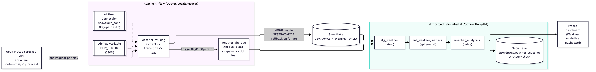

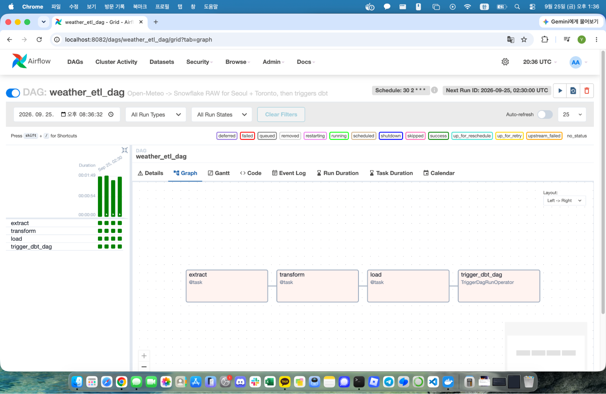

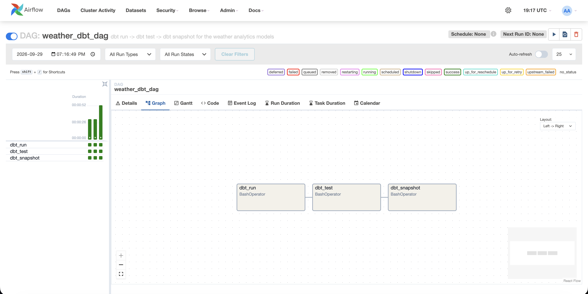

## 5. Data Flow

1. `weather_etl_dag.extract()` reads `CITY_CONFIG`, calls Open-Meteo once
   per city, and returns each city's daily data.
2. `weather_etl_dag.transform()` flattens each city's daily arrays into
   `(city, latitude, longitude, date, temp_max, temp_min, precipitation,
   weather_code)` rows.
3. `weather_etl_dag.load()` replaces the contents of
   `RAW.CITY_WEATHER_DAILY` with those rows (`DELETE` + `INSERT`) inside one
   transaction, then `trigger_dbt_dag` starts `weather_dbt_dag`.
4. `weather_dbt_dag` runs `dbt run` (builds `weather_analytics`, with
   `weather_daily` and `weather_metrics`), then `dbt test`,
   then `dbt snapshot` (`weather_snapshot`).
5. The BI tool queries `ANALYTICS.WEATHER_ANALYTICS` directly.

## 6. Airflow Implementation

- **DAG 1 -- `weather_etl_dag`** (`dags/weather_etl_dag.py`): TaskFlow API
  (`@task`), tasks `extract -> transform -> load`, scheduled daily
  (`30 2 * * *`), `catchup=False`, `max_active_runs=1`. Final task
  `trigger_dbt_dag` (`TriggerDagRunOperator`) starts `weather_dbt_dag` after
  `load` succeeds.
- **DAG 2 -- `weather_dbt_dag`** (`dags/weather_dbt_dag.py`): three
  `BashOperator` tasks, `dbt_run -> dbt_test -> dbt_snapshot`, each invoking
  `dbt <command> --profiles-dir /opt/airflow/dbt` against the dbt project
  mounted into the container. `schedule=None`: this DAG never runs on its
  own timer, only via the trigger from DAG 1.
- **Airflow Variable**: `CITY_CONFIG`, a JSON object mapping city name to
  `{latitude, longitude, timezone}`.
- **Airflow Connection**: `snowflake_conn`, type Snowflake, key-pair
  authentication (private key file mounted read-only into the container;
  passphrase stored only in the Connection's Password field, never in code
  or files). The ETL DAG uses it through `SnowflakeHook`. The dbt DAG reads
  it with `BaseHook.get_connection('snowflake_conn')` and passes the values
  to dbt as `DBT_*` environment variables, which `dbt/profiles.yml` reads
  with `env_var()`.
- **Exception handling**: `load()` wraps the transaction in
  `try/except`; on any exception it issues `ROLLBACK`, prints the error,
  and **re-raises** so the Airflow task is correctly marked failed (no
  silent swallowing). `extract()` calls `raise_for_status()` on each API
  response, so an HTTP error fails the task before anything is loaded.

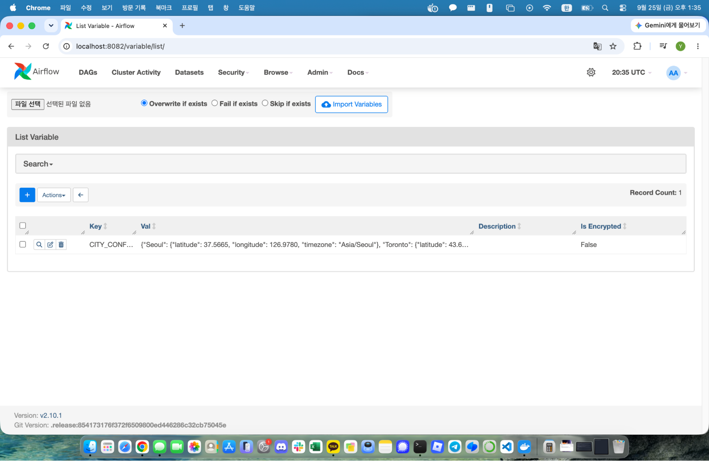

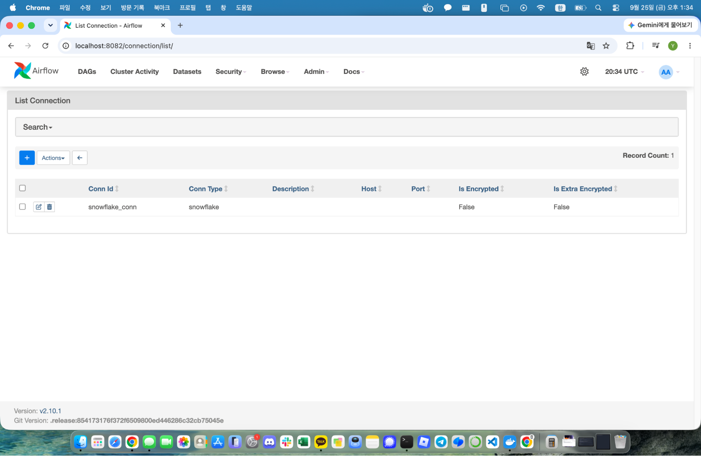

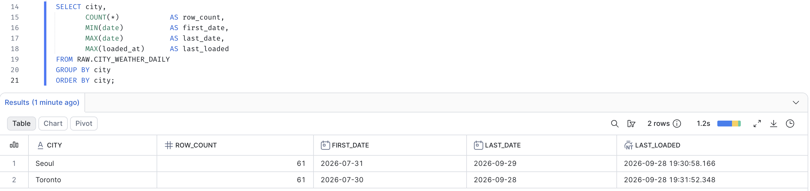

## 7. Snowflake Design

All objects live in the database set on the `snowflake_conn` Connection;
no database name appears in the DAGs or the dbt project. Schema `RAW` holds
the landing table, schema `ANALYTICS` holds dbt's output, and schema
`SNAPSHOTS` holds the dbt snapshot. The ETL DAG creates `RAW` and the raw
table if they don't exist, and dbt creates `ANALYTICS` and `SNAPSHOTS`, so
the pipeline runs on a database with no existing schemas. See
`sql/create_tables.sql` for the raw table DDL (also embedded in
`weather_etl_dag.py`'s `load()` so the pipeline is self-provisioning).

## 8. Table Structures

All three tables below were inspected directly in the live Snowflake account
(`DESC TABLE`) to confirm actual column types and nullability, not assumed
from the DDL/model SQL alone -- Snowflake sometimes normalizes or relaxes
both (e.g. `INTEGER` is stored as `NUMBER(38,0)`; `CREATE TABLE AS SELECT`
makes every output column nullable regardless of the source). The two
transform models, `weather_daily` and `weather_metrics`, are ephemeral, so
they have no table or view in Snowflake.

### `RAW.CITY_WEATHER_DAILY` (raw, loaded by Airflow)

| Column | Type | Nullable | Constraint | Description |
| --- | --- | --- | --- | --- |
| CITY | VARCHAR(64) | N | part of PK | City name (`Seoul`, `Toronto`) |
| LATITUDE | FLOAT | N | -- | Requested latitude |
| LONGITUDE | FLOAT | N | -- | Requested longitude |
| DATE | DATE | N | part of PK | Local calendar date of the reading |
| TEMP_MAX | FLOAT | Y | -- | Daily max temperature, Celsius |
| TEMP_MIN | FLOAT | Y | -- | Daily min temperature, Celsius |
| PRECIPITATION | FLOAT | Y | -- | Daily precipitation total, mm |
| WEATHER_CODE | NUMBER(38,0) | Y | -- | WMO weather interpretation code (declared `INTEGER`; Snowflake stores all integers as `NUMBER(38,0)`) |
| LOADED_AT | TIMESTAMP_NTZ(9) | Y | default `CURRENT_TIMESTAMP()` | Time the row was inserted by the most recent load |

Declared key: `PRIMARY KEY (CITY, DATE)` (declarative only in Snowflake;
the full-refresh load means each `(city, date)` is inserted exactly once per
run, and the `unique` test on `city_date` in `weather_analytics` verifies
it downstream).

### `ANALYTICS.WEATHER_ANALYTICS` (dbt table -- BI source)

| Column | Type | Nullable | Description |
| --- | --- | --- | --- |
| CITY | VARCHAR(64) | Y | Partition key for every window function |
| LATITUDE | FLOAT | Y | Carried through |
| LONGITUDE | FLOAT | Y | Carried through |
| WEATHER_DATE | DATE | Y | Calendar date (renamed from raw's `DATE` in `weather_daily`) |
| CITY_DATE | VARCHAR(16777216) | Y | Surrogate key `CITY \|\| '_' \|\| TO_VARCHAR(DATE, 'YYYY-MM-DD')`, built in `weather_daily`; tested `unique` + `not_null` |
| TEMP_MAX | FLOAT | Y | Carried through |
| TEMP_MIN | FLOAT | Y | Carried through |
| PRECIPITATION | FLOAT | Y | Carried through |
| WEATHER_CODE | NUMBER(38,0) | Y | Carried through |
| DAILY_AVG_TEMP | FLOAT | Y | `(TEMP_MAX + TEMP_MIN) / 2` |
| DRY_SPELL_LENGTH | NUMBER(18,0) | Y | Consecutive dry days (< 0.1mm precip) ending on this date |
| MOVING_AVG_TEMP_7D | FLOAT | Y | 7-day trailing average of `DAILY_AVG_TEMP`, `PARTITION BY city`, rounded to 2 decimals |
| TEMP_ANOMALY | FLOAT | Y | `DAILY_AVG_TEMP` minus that city's average over the loaded window, rounded to 2 decimals |
| ROLLING_PRECIP_7D | FLOAT | Y | 7-day trailing sum of `PRECIPITATION`, `PARTITION BY city`, rounded to 2 decimals |

No declared key (table, materialized from a `SELECT`). Every column is
nullable at the database level -- `CREATE TABLE AS SELECT` does not carry
`NOT NULL` forward from the raw table, even though the
`city_date`/`city`/`weather_date` columns are never actually null in
practice. Uniqueness and non-null-ness are enforced by the dbt tests in
`models/schema.yml`, not by the table's DDL.

### `SNAPSHOTS.WEATHER_SNAPSHOT` (dbt snapshot)

| Column | Type | Nullable | Description |
| --- | --- | --- | --- |
| CITY | VARCHAR(64) | Y | From `weather_analytics` |
| LATITUDE | FLOAT | Y | From `weather_analytics` |
| LONGITUDE | FLOAT | Y | From `weather_analytics` |
| WEATHER_DATE | DATE | Y | From `weather_analytics` |
| CITY_DATE | VARCHAR(16777216) | Y | Snapshot `unique_key` |
| TEMP_MAX | FLOAT | Y | Tracked by `check` strategy |
| TEMP_MIN | FLOAT | Y | Tracked by `check` strategy |
| PRECIPITATION | FLOAT | Y | Tracked by `check` strategy |
| WEATHER_CODE | NUMBER(38,0) | Y | Tracked by `check` strategy |
| DAILY_AVG_TEMP | FLOAT | Y | From `weather_analytics`, not a `check_cols` column |
| DRY_SPELL_LENGTH | NUMBER(18,0) | Y | From `weather_analytics`, not a `check_cols` column |
| MOVING_AVG_TEMP_7D | FLOAT | Y | From `weather_analytics`, not a `check_cols` column |
| TEMP_ANOMALY | FLOAT | Y | From `weather_analytics`, not a `check_cols` column |
| ROLLING_PRECIP_7D | FLOAT | Y | From `weather_analytics`, not a `check_cols` column |
| DBT_SCD_ID | VARCHAR(32) | Y | dbt-generated: unique ID for this SCD Type 2 row version |
| DBT_UPDATED_AT | TIMESTAMP_NTZ(9) | Y | dbt-generated: when this row version was recorded |
| DBT_VALID_FROM | TIMESTAMP_NTZ(9) | Y | dbt-generated: start of this row version's validity |
| DBT_VALID_TO | TIMESTAMP_NTZ(9) | Y | dbt-generated: end of this row version's validity (`NULL` = current) |

Snapshot key: `unique_key='city_date'`, `strategy='check'` on
`[temp_max, temp_min, precipitation, weather_code]` (see
`snapshots/weather_snapshot.sql`). The computed metric columns are stored in
every row version but are not in `check_cols`; Section 13 explains why.

## 9. Idempotency Design

Rerunning `weather_etl_dag` must not create duplicate rows. This is enforced
in `load()` (`dags/weather_etl_dag.py`) with full-refresh pattern:

1. `CREATE SCHEMA IF NOT EXISTS RAW` and `CREATE TABLE IF NOT EXISTS` run
   **before** `BEGIN`, since Snowflake DDL auto-commits and would otherwise
   end an open transaction early.
2. Inside one `BEGIN`, `DELETE FROM RAW.CITY_WEATHER_DAILY` removes the
   previous load, and every extracted row is inserted with a parameterized
   `INSERT` (`%s` placeholders, so a missing API value becomes SQL `NULL`).
3. `COMMIT` makes the delete and inserts visible together. Any exception
   anywhere in the block triggers `ROLLBACK` and re-raises, so the previous
   data is kept and Airflow marks the task failed.

Net effect: running the DAG twice replaces the whole table's contents with
the current 61-day window per city, rather than appending a second copy of
each row.

## 10. dbt Implementation

See `dbt/README.md` for the full layer-by-layer breakdown. Summary:
`weather_daily` (ephemeral) -> `weather_metrics` (ephemeral) ->
`weather_analytics` (table), all analytics window functions
`PARTITION BY city`.

## 11. dbt Models

- `models/transform/weather_daily.sql`
- `models/transform/weather_metrics.sql`
- `models/analytics/weather_analytics.sql`

## 12. dbt Tests

Defined in `models/schema.yml`, all on `weather_analytics`: `unique` +
`not_null` on `city_date`; `not_null` on `city` and `weather_date`;
`accepted_values` on `city` (`Seoul`, `Toronto`). Because the transform
models pass every row straight through to `weather_analytics`, testing the
final table also covers them.

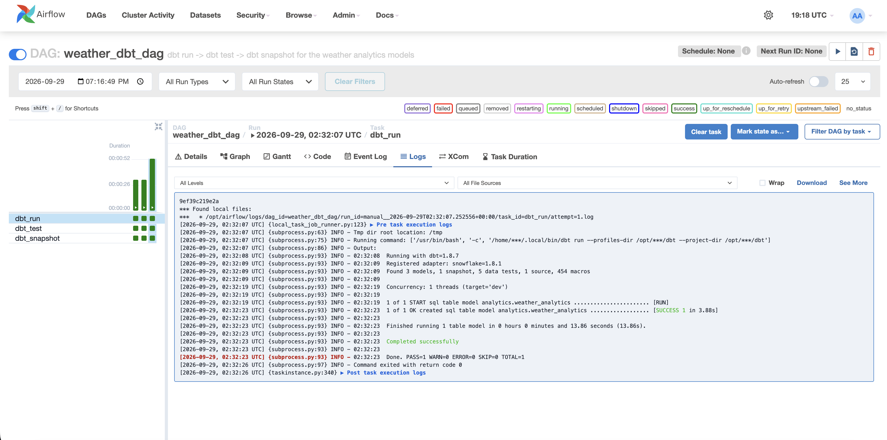

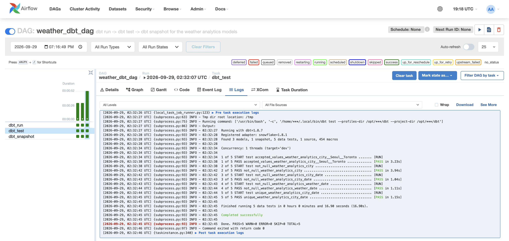

## 13. dbt Snapshot

`snapshots/weather_snapshot.sql`, `strategy='check'`, keyed on `city_date`,
with `check_cols` limited to the raw weather columns (`temp_max`,
`temp_min`, `precipitation`, `weather_code`). See Section 8 for its
resulting columns and Section 3 for why `check` was chosen over `timestamp`.

The computed metrics are left out of `check_cols` on purpose. They shift
whenever the 61-day window moves even if the weather data hasn't changed:
`temp_anomaly`, for example, is measured against the city's average over the
whole window, so when one day drops out and a new one comes in, every row's
anomaly changes slightly. Checking those columns would create a new version
of all 122 rows on every run and bury the real revisions. With only the raw
columns checked, a new version is recorded when Open-Meteo revises a day's
values, and a row is closed out when its day ages out of the window.

Both cases showed up in testing. After a few runs on 2026-09-26/27, the
snapshot held 124 rows: 122 current rows, one earlier version of
`Seoul_2026-09-27` (its `temp_max` was revised from 26.2 to 26.3 and
`temp_min` from 16.3 to 16.2 as the day's observations came in), and one
closed-out `Toronto_2026-07-28`, which dropped out of the window when
Toronto's local date rolled over to September 27.

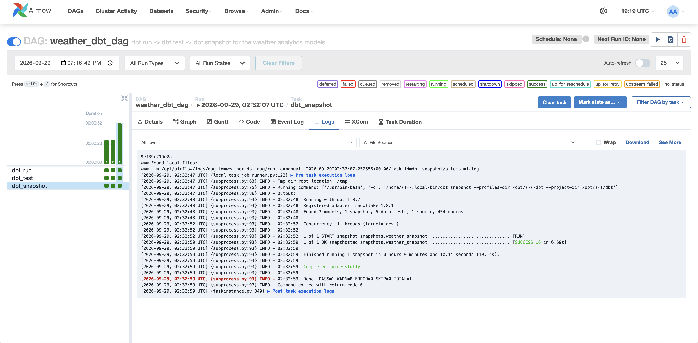

## 14. Airflow/dbt Scheduling

`weather_etl_dag` is the only DAG on a cron schedule (`30 2 * * *`).
`weather_dbt_dag` has `schedule=None` and is started exclusively by
`weather_etl_dag`'s last task, `trigger_dbt_dag`
(`TriggerDagRunOperator(trigger_dag_id="weather_dbt_dag")`). This makes the
"ETL succeeds, then dbt runs" dependency visible directly in the DAG code
and in the Airflow UI (two separate DAGs, one triggering the other), rather
than relying on scheduling two DAGs far enough apart in time.

## 15. BI Dashboard

**Status: complete.** **Tool:** [Preset](https://preset.io) (cloud-hosted
Apache Superset). **Team/Workspace:** "DATA 226 Weather Analytics" /
"Weather Analytics Lab". **Dashboard name:** "Weather Analytics Dashboard".
**Dataset:** `ANALYTICS.WEATHER_ANALYTICS`.

**Purpose:** let a viewer compare Seoul vs. Toronto's current weather trend
-- temperature level and trajectory, anomaly, and precipitation -- without
reading raw numbers. **Usage:** select a city (or leave both selected) via
the dashboard's `CITY` filter, narrow the `WEATHER_DATE` time range, and all
four charts update together.

**Authentication:** Preset could not use a plain Snowflake username/password
connection because this account requires MFA/TOTP. The dashboard instead
connects using the same Snowflake **key-pair authentication** already used
by Airflow and dbt, configured through Preset's **Advanced -> Security ->
Secure Extra** field rather than the basic login form. That field lives only
in Preset's hosted connection config -- the key and passphrase were never
written to this repository. See the root `README.md` -> "Security /
secrets".

**The four charts, all grouped by `CITY`:**

1. **Seoul vs. Toronto Daily Avg Temp** -- line chart, X = `WEATHER_DATE`,
   metric `AVG(DAILY_AVG_TEMP)`, dimension `CITY`.
2. **7-Day Moving Average Temperature** -- line chart, X = `WEATHER_DATE`,
   metric `AVG(MOVING_AVG_TEMP_7D)`, dimension `CITY`.
3. **Temperature Anomaly** -- bar chart, X = `WEATHER_DATE`, metric
   `AVG(TEMP_ANOMALY)`, dimension `CITY`.
4. **7-Day Rolling Precipitation** -- bar chart, X = `WEATHER_DATE`, metric
   `AVG(ROLLING_PRECIP_7D)`, dimension `CITY`.

**Filters:** native dashboard filters on `CITY` and on `WEATHER_DATE` (time
range), applied across all four charts at once.

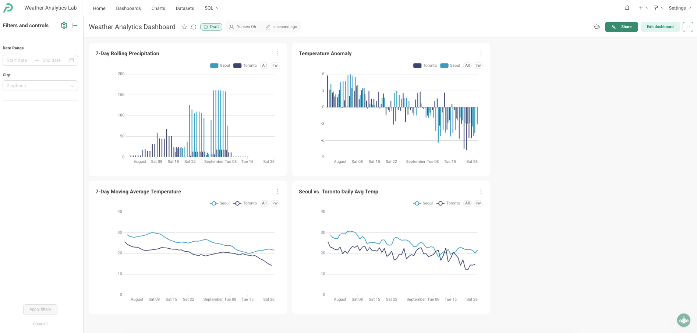

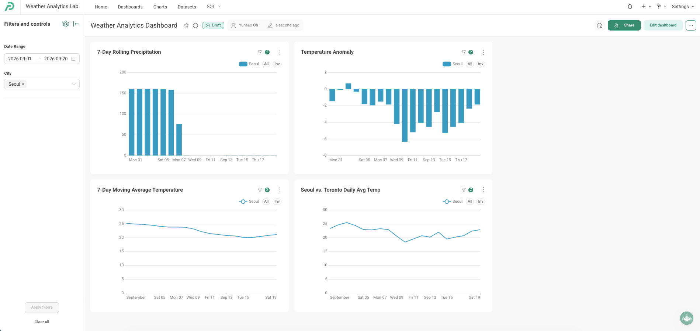

## 16. Results / Observations

The pipeline was run end-to-end against live data (see Section 18,
Conclusion, for the full verification summary). As of the run on
2026-09-25/26, over the ~61-day loaded window:

- Both cities were in the middle of an extended dry spell at the same time:
  Seoul had gone 14 consecutive days with under 0.1mm of precipitation,
  Toronto 17 days -- both `rolling_precip_7d` values were at or effectively
  at 0.
- Both cities' most recent days ran cooler than their loaded-window average:
  Seoul's temperature anomaly was around -3 to -5 degrees C over its last
  several days; Toronto's was around -5 to -8 degrees C, reaching -7.76 on
  2026-09-22 (its `daily_avg_temp` that day, 12.15 degrees C, was well under
  its ~19.9 degrees C window average).
- Seoul's window average `daily_avg_temp` (~24.8 degrees C) was
  meaningfully warmer than Toronto's (~19.9 degrees C) over the same
  calendar period, as expected in late-summer-to-fall for the two cities'
  respective climates.
- Anomaly range across the window: Seoul -6.36 to +5.94 degrees C; Toronto
  -7.76 to +5.74 degrees C -- both cities show comparable volatility around
  their own baseline despite the ~5 degree gap in absolute average
  temperature, which is exactly the kind of city-relative comparison
  `temp_anomaly` (computed `PARTITION BY city`) is meant to surface.

These figures came from querying `ANALYTICS.WEATHER_ANALYTICS` directly
after a real `dbt run`, and the Preset dashboard confirms the same pattern
visually (Figures 9-10, Section 15): the default-view "Temperature Anomaly"
chart ranges from roughly -8 to +6 for both cities, matching the -7.76 to
+5.94 range computed here, and "7-Day Rolling Precipitation" shows both
cities' bars taper toward zero at the right edge of the window, matching the
Seoul/Toronto dry spell described above. The filtered view (Figure 10,
isolated to Seoul, 2026-09-01 to 2026-09-20) shows Seoul's rolling
precipitation dropping from roughly 150mm to near 0 by the end of that
range and its anomaly staying mostly negative through September -- the same
transition into the dry spell visible in the unfiltered chart, now isolated
to one city.

## 17. Future Work

- Add more cities by extending the `CITY_CONFIG` Airflow Variable and the
  `accepted_values` test.
- Backfill a longer history (Open-Meteo's archive API) to make
  `temp_anomaly` a true climatological anomaly instead of a
  within-loaded-window baseline.
- Add a `freshness` check on the `raw.city_weather_daily` source so a stale
  load surfaces before dbt silently reruns on old data.
- Alerting (Slack/email) on Airflow task failure or dbt test failure.

## 18. Conclusion

The pipeline was verified end-to-end in a real local Airflow environment:
`weather_etl_dag` (extract, transform, load) and the triggered
`weather_dbt_dag` (dbt run, test, snapshot) both completed successfully
against the live Snowflake account, loading real Seoul and Toronto data and
passing all 5 dbt tests. Rerunning the ETL DAG confirmed the full-refresh
load is idempotent: the raw and analytics tables held 122 rows (61 per
city) after every run. The repository was also tested from a fresh clone
with a new Airflow container against an empty Snowflake database: following
only the README setup (`.env`, the `CITY_CONFIG` Variable, and the
`snowflake_conn` Connection), both DAGs ran green and created all three
tables with no file edits. One Airflow codebase and one dbt project handle
both cities through the `CITY_CONFIG` Variable and `PARTITION BY city`
window functions, satisfying the assignment's requirement to treat city as
configuration rather than forking the pipeline per city.

The BI layer is also complete: a Preset dashboard ("Weather Analytics
Dashboard") connects to `ANALYTICS.WEATHER_ANALYTICS` -- via Snowflake
key-pair authentication through Preset's Secure Extra configuration, working
around this account's MFA requirement -- and presents four charts (daily
average temperature, 7-day moving average, temperature anomaly, 7-day
rolling precipitation), all grouped by city and filterable by city and date
range. End to end, the project satisfies Open-Meteo -> Airflow -> Snowflake
RAW -> dbt -> Snowflake analytics -> BI dashboard with one shared pipeline
for both cities, and all 10 required screenshots (Airflow Variables and
Connections, both DAG graph views, the raw table row counts, the three dbt
task logs, and both dashboard views) are captured and present in
`screenshots/`, embedded throughout this report as Figures 1-10 (Sections 4,
6, 12, 13, and 15), alongside the system architecture diagram in Section 4.
The repository is public at the URL above, and the submission date is
recorded above. This report is complete.

## 19. References

- [Open-Meteo API Documentation](https://open-meteo.com/en/docs)
- [Apache Airflow Documentation](https://airflow.apache.org/docs/)
- [dbt Documentation](https://docs.getdbt.com/)
- [Snowflake Documentation](https://docs.snowflake.com/)
- [Preset / Apache Superset Documentation](https://docs.preset.io/)
